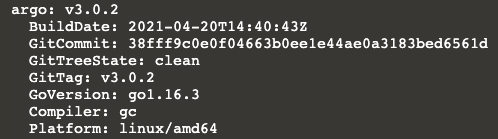

To run workflows, the easiest way is to use the Argo CLI, you can download it as follows:
```
curl -sLO https://github.com/argoproj/argo-workflows/releases/download/v3.4.7/argo-linux-amd64.gz
gunzip argo-linux-amd64.gz
chmod +x argo-linux-amd64
mv ./argo-linux-amd64 /usr/local/bin/argo
```{{execute}}

To check it is installed correctly:

`argo version`{{execute}}

You should see something like this:



Let's run a workflow!

`argo submit -n argo --watch https://raw.githubusercontent.com/argoproj/argo-workflows/master/examples/hello-world.yaml`{{execute}}

You should see the workflow complete successfully after about 1m:


You can list workflows easily:

`argo list -n argo`{{execute}}


Get details about a specific workflow. `@latest` is an alias for the latest workflow:

`argo get -n argo @latest`{{execute}}

And you can view that workflows logs:

`argo logs -n argo @latest`{{execute}}


Finally, you can get help:

`argo --help`{{execute}}

## Exercise

Submit a workflow, but change the name using the `--name` option.
