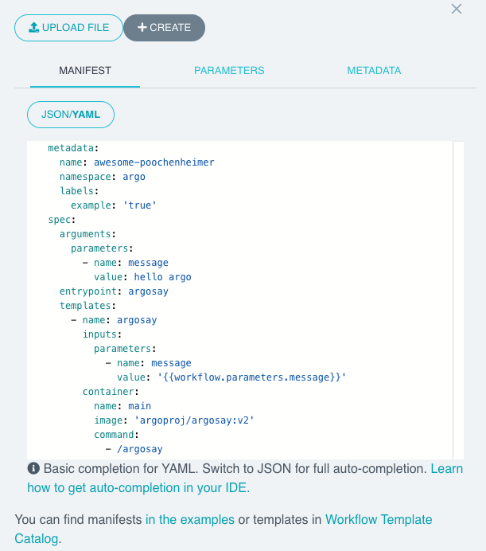

You can view the user interface by running a port forward:

`kubectl -n argo port-forward --address 0.0.0.0 svc/argo-server 2746:2746 > /dev/null &`{{execute}}

To check this is working correctly, you can curl the info API:

`curl -kv https://localhost:2746/api/v1/info`{{execute}}

You should see `HTTP/1.1 200 OK`.

Argo Server listens on port 2746. Often the server will be installed behind a load balancer with TLS enabled. When this happens it will be available on port 443.

## Run a workflow

Open the "Argo Server" tab and you should see the user interface:


Lets start a workflow from the user interface:

Click "Submit new workflow":


Click "Edit using full workflow options". You should see something similar to this:



Paste this YAML into the editor:

```
apiVersion: argoproj.io/v1alpha1
kind: Workflow
metadata:
  generateName: hello-world-  
spec:
  entrypoint: main        
  templates:
  - name: main           
    container: 
      image: docker/whalesay  
```{{copy}}

Click "Create". You will see a diagram of the workflow. The yellow icon shows that it is pending, after a few seconds it'll turn blue to indicate it is running, and finally green to show that it has completed successfully:


After about 30s, the icon will change to green:


## Exercise

Take a few minutes to play around with the user interface. Find out how to:
 
* List workflows.
* View a workflow.
* Resubmit a completed workflow.
