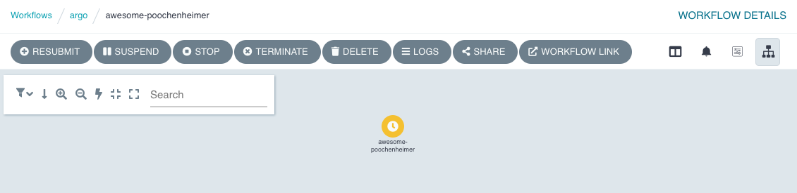

Helm allows us to configure our deployment by modifying [the default values](https://github.com/argoproj/argo-helm/blob/main/charts/argo-workflows/values.yaml).

**The argo-server (and thus the UI) defaults to client authentication, which requires clients to provide their Kubernetes bearer token in order to authenticate.** For more information, refer to the [Argo Server Auth Mode documentation](https://argoproj.github.io/argo-workflows/argo-server-auth-mode/).

We will switch the authentication mode to server so that we can bypass the UI login for now. **This is not something we recommend for production installs.**

```bash
helm repo add argo https://argoproj.github.io/argo-helm
helm repo update
helm install argo argo/argo-workflows --namespace argo --create-namespace \
  --set server.extraArgs[0]="--auth-mode=server" \
  --set workflow.serviceAccount.create=true
```{{execute}}

We need to wait for the Argo Server to deploy:

`kubectl -n argo rollout status --watch --timeout=600s deployment/argo-argo-workflows-server`{{execute}}

You can then view the user interface by running a port forward:

`kubectl -n argo port-forward --address 0.0.0.0 svc/argo-argo-workflows-server 2746:2746 > /dev/null &`{{execute}}

You can then [click here to access the UI]({{TRAFFIC_HOST1_2746}}). As it's your first time using the Workflows UI, you will see a number of modals explaining the new features. Dismiss them.

## Run a workflow

Open the "Argo Server" tab and you should see the user interface:


Lets start a workflow from the user interface:

Click "Submit new workflow":


Click "Edit using full workflow options". You should see something similar to this:


Paste this YAML into the editor:

```yaml
metadata:
  generateName: hello-world-
  namespace: argo
spec:
  serviceAccountName: argo-workflow
  entrypoint: main
  templates:
    - name: main
      container:
        image: busybox
        command: ["echo"]
        args: ["hello world"]
```{{copy}}

Click "Create". You will see a diagram of the workflow. The yellow icon shows that it is pending, after a few seconds it'll turn blue to indicate it is running, and finally green to show that it has completed successfully:



After about 30s, the icon will change to green:


